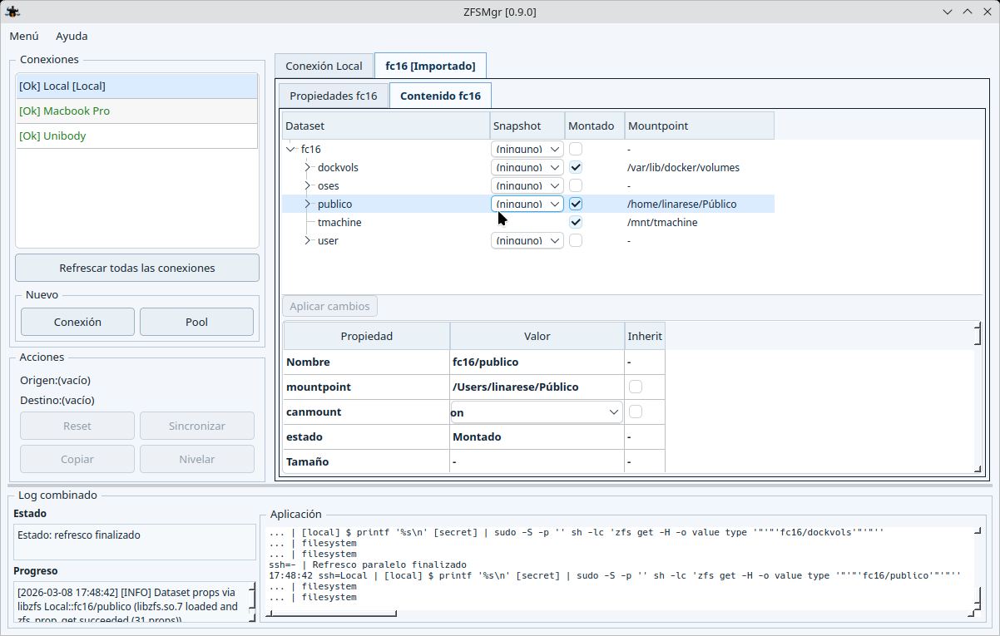

# ZFSMgr (C++/Qt)

Cross-platform OpenZFS GUI manager built with **C++17 + Qt6** for **Linux, macOS, and Windows**.

## Beta notice and legal disclaimer

This software is currently a **BETA** release and is provided **"AS IS"**.

- It may contain defects, regressions, data-loss scenarios, or incomplete behaviors.
- Use it at your own risk, especially on production systems or critical data.
- The author (Eladio Linares) provides **no warranty** and assumes **no liability** for direct or indirect damage, data loss, service interruption, or any other consequence derived from use.

Legal references:

- **GNU GPL v3**, Section 15: **Disclaimer of Warranty**.
- **GNU GPL v3**, Section 16: **Limitation of Liability**.

## Screenshot



## Releases

- **Beta 0.9.1**: https://github.com/Nazari/ZFSMgr/releases

## Main capabilities

- Remote connection management (SSH and Windows through SSH/PowerShell).
- Full/partial refresh and remote OpenZFS version detection.
- Pool management:
  - unified imported/importable pool list,
  - import/export,
  - pool creation with device selection and options,
  - pool destroy with strong confirmation.
- Dataset and snapshot management:
  - create, modify, rename (`zfs rename`), delete,
  - mount/unmount (including recursive flows),
  - snapshot rollback.
- Source/destination transfers:
  - snapshot copy (`zfs send`/`zfs recv`),
  - level and sync operations,
  - breakdown/assemble operations.
- Advanced operations:
  - `From Dir` and `To Dir` with optional source deletion.
- Logging:
  - combined UI log plus persistent rotating logs,
  - selectable log level and visible line limits (from main menu),
  - command and execution detail views.
- Multi-language UI (Spanish, English, Chinese) with runtime switching.
- Secret masking in logs (`[secret]`).

## Remote source/destination support

ZFSMgr can operate with **remote source and/or destination** on:

- Linux
- macOS/Unix
- Windows

The app adapts command strategies by remote OS and available tooling.

## Windows compatibility checks

For Windows targets, ZFSMgr validates runtime prerequisites so operations can run safely:

- OpenZFS tools availability (`zfs`, `zpool`), including common install paths.
- Shell/runtime availability and compatibility (PowerShell and optional MSYS64/MINGW tooling when needed).
- Command path resolution and fallback behavior for mixed Unix/Windows command flows.
- Mount semantics handling (including `driveletter`-based effective mount resolution).

If required components are missing, connection status and command availability are reported in the UI/logs.

## UI layout

- Left panel: connections list + quick actions.
- Right panel: dynamic tabs per selected connection and its pools (properties/content/status).
- Bottom panel: combined log.

## Configuration and data

- User config location: `~/.config/ZFSMgr/` on Linux (Qt-equivalent path on macOS/Windows).
- Main config file: `config.ini`.
- One file per connection: `conn_*.ini`.
- Master password used to protect credentials in configuration.

## Build requirements

- CMake >= 3.21
- C++17-capable compiler
- Qt6 (`Core`, `Gui`, `Widgets`)
- OpenSSL (especially relevant on Windows/Qt environments)

## Quick build

### Linux

```bash
./build-linux.sh
```

Expected binary: `build-linux/zfsmgr_qt`

### Linux AppImage (portable)

```bash
./build-linux-appimage.sh
```

What it does:

- builds a Release binary,
- creates an AppDir,
- bundles Qt dependencies with `linuxdeploy` + `linuxdeploy-plugin-qt`,
- generates `ZFSMgr-0.9.1-x86_64.AppImage`.

Notes:

- Current script target: `x86_64`.
- Requires `curl` and a working Qt toolchain in PATH (`qmake6`/`qmake`).
- The script auto-downloads `linuxdeploy` tools into `.tools/appimage/`.

### macOS

```bash
./build-macos.sh
```

The script builds the binary and can also generate an unsigned `.app` bundle.

### Windows (PowerShell)

```powershell
.\build-windows.ps1
```

The script auto-detects toolchain/Qt and builds under `build-windows`.

## Run

After building, run the generated binary for your platform and unlock with the master password.
