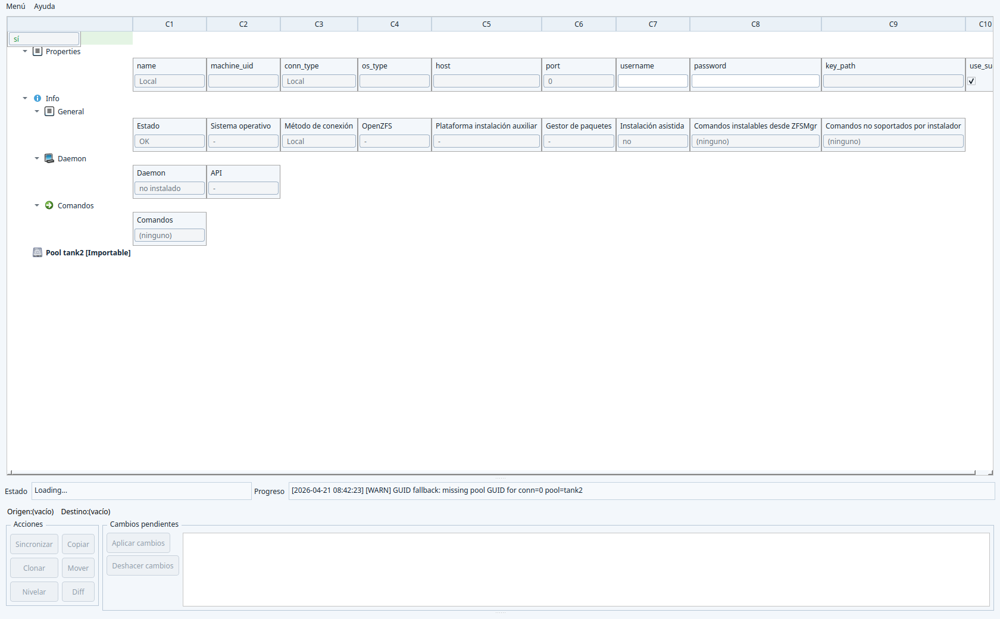

# ZFSMgr: OpenZFS GUI Manager for Local and Remote Systems

**ZFSMgr** is a **full OpenZFS GUI manager** built with **C++17 + Qt6** for **Linux, FreeBSD, macOS, and Windows**.

If you are looking for a **ZFS GUI manager**, **OpenZFS GUI**, **remote ZFS manager**, or a **desktop ZFS administration tool**, ZFSMgr is designed to cover the whole workflow from one interface:

- pools,
- datasets,
- snapshots,
- properties,
- delegated permissions,
- encryption,
- replication flows,
- and remote administration over SSH.

ZFSMgr is not a simple pool browser. It is intended to be a **complete graphical manager for ZFS and OpenZFS environments**, including **remote pools and datasets on other machines**.

## Beta notice and legal disclaimer

This software is currently a **BETA** release and is provided **"AS IS"**.

- It may contain defects, regressions, data-loss scenarios, or incomplete behaviors.
- Use it at your own risk, especially on production systems or critical data.
- The author (Eladio Linares) provides **no warranty** and assumes **no liability** for direct or indirect damage, data loss, service interruption, or any other consequence derived from use.

Legal references:

- **GNU GPL v3**, Section 15: **Disclaimer of Warranty**.
- **GNU GPL v3**, Section 16: **Limitation of Liability**.

## Screenshots

### Main window



### Pool creation


### Dataset creation


## Releases

- **Current beta line**: check the latest published release here:
  https://github.com/Nazari/ZFSMgr/releases

## Cross-compiling from Linux

There is now a Linux cross-compiling base for:

- Windows
- FreeBSD
- macOS (with osxcross)

Entry point:

```bash
./scripts/provision-cross-targets.sh --windows --freebsd
./scripts/build-cross.sh --target windows --doctor
./scripts/build-cross.sh --target freebsd --doctor
./scripts/build-cross.sh --target macos --doctor
```

Documentation:

- `docs/cross-compiling-linux.md`

## Why ZFSMgr

ZFSMgr is designed for users who want a real **GUI for ZFS administration** without giving up low-level OpenZFS functionality.

It gives you:

- a **single unified connection/pool/dataset tree** for all navigation,
- **logical source/target selection** from the dataset context menu,
- **remote pool and dataset management** from the same desktop app,
- a **connectivity matrix** between connections with `SSH` and `rsync` checks,
- **inline editing** of dataset and pool properties directly in the treeview,
- **permission delegation management** with `zfs allow` / `zfs unallow`,
- **automatic snapshot scheduling and leveling** using the remote daemon scheduler,
- **snapshot-oriented workflows** such as copy, clone, diff, rollback and level/sync,
- a **graphical pool builder** with OpenZFS-aware VDEV validation,
- **encrypted dataset creation and mount flows** with passphrase prompts when `keylocation=prompt`,
- **persistent operational logs** with secret masking,
- and **native system logging** integration on macOS, Linux and Windows.

## Main capabilities

### Pool management

- Imported and importable pool discovery.
- Pool import/export.
- Pool import with rename validation from the context menu.
- Pool upgrade from the GUI (`zpool upgrade`).
- Pool creation with device selection and options.
- Device tree for available block devices, including whole disks and partitions.
- OpenZFS-aware pool layout builder:
  - direct devices at pool root for implicit stripe,
  - `mirror`,
  - `raidz`, `raidz2`, `raidz3`,
  - top-level classes such as `log`, `cache`, `special`, `dedup`, `spare`.
- Live `zpool create` preview with invalid layouts highlighted in red.
- macOS-specific filtering for internal APFS/synthesized system disks.
- Mount-state controls in the pool-creation dialog to unmount devices before use.
- Pool destroy with confirmation.
- Pool history view.
- Pool maintenance actions from the GUI:
  - `zpool sync`
  - `zpool scrub`
  - `zpool upgrade`
  - `zpool reguid`
  - `zpool trim`
  - `zpool initialize`
- Pool information and scheduled-dataset visibility directly in the unified tree.

### Dataset, zvol and snapshot management

- Create dataset, snapshot and zvol.
- Automatic snapshot scheduling node for filesystem datasets.
- Create encrypted datasets with passphrase confirmation when using:
  - `encryption=on` or `aes-*`,
  - `keyformat=passphrase`,
  - `keylocation=prompt`.
- Rename and delete datasets.
- Pool root fused with its root dataset in the tree:
  - the pool root keeps pool icon and tooltip,
  - the duplicate `pool/pool/...` visual level is removed.
- Context-aware delete actions for:
  - dataset,
  - snapshot,
  - zvol.
- Mount/unmount operations.
- Mount encrypted datasets by prompting for the passphrase and loading the key before mount when required.
- Snapshot rollback.
- Snapshot selection directly in the unified tree.
- Optional filtering of automatic snapshots (`GSA-*`) from dataset context menus.
- Snapshot holds:
  - create hold,
  - inspect hold timestamp,
  - release hold.

### Automatic snapshot scheduling and leveling

- Per-dataset scheduling is defined with ZFS user properties (`org.fc16.gsa:*`):
  - enabled,
  - recursive,
  - hourly/daily/weekly/monthly/yearly retention,
  - leveling,
  - destination dataset.
- Destination values use the `Connection::Pool/Dataset` format.
- Scheduling execution is handled by the installed remote daemon (`zfsmgr-agent`), not by GUI polling.
- The daemon owns scheduler integration with the host OS.
- Connection context menu exposes daemon lifecycle:
  - install/update (single action),
  - uninstall,
  - up-to-date/running state.
- ZFSMgr auto-checks daemon version/API on refresh/connect and can auto-update when required.
- Validation avoids conflicting recursive schedules between parent and child datasets.
- Sequential leveling toward configured destinations is supported.
- Scheduler events are appended to `GSA.log` and surfaced in the UI log tabs.

### Inline property management

- Dataset, pool and snapshot properties shown **inline in the unified tree**.
- Visual property groups per scope:
  - pool,
  - dataset,
  - snapshot.
- Main inline nodes currently include:
  - `Dataset properties`
  - `Pool Information`
    - includes `Devices` (pool vdev/disk hierarchy from `zpool status -P`)
  - `Datasets programados`
  - `Info`
    - `General`
    - `Daemon`
    - `Commands`
- Reorder visible properties by drag and drop.
- Persist visible properties and order in configuration.
- Inline editing of property values.
- Inline inheritance controls for inheritable properties.
- Property column count configurable from the tree header context menu.
- Current property-column range:
  - `4, 6, 8, 10, 12, 14, 16`

### ZFS permissions management

ZFSMgr includes **graphical management of delegated ZFS permissions** per dataset.

Current permission features include:

- A dedicated permissions node in dataset trees.
- Delegation management based on:
  - `zfs allow`
  - `zfs unallow`
- Support for:
  - users,
  - groups,
  - `everyone`,
  - local / descendant / local+descendant scopes,
  - creation-time permissions,
  - permission sets (`@setname`).
- Inline permission editing in treeview grids.
- Draft-based permission editing with batch application through **`Aplicar cambios`**.
- Remote user/group enumeration on Linux, FreeBSD and macOS.
- Windows excluded from permission UI in this phase.

### Encryption workflows

- Encryption submenu for encryption-root datasets.
- `Load key`.
- `Unload key`.
- `Change key`.
- Prompted password entry when `keylocation=prompt`.
- `Create dataset` and `Mount` integrate passphrase prompts instead of expecting interactive shell input.

### Source/target workflows

ZFSMgr uses a **source / target model** directly in the main window.

That enables:

- snapshot copy (`zfs send` / `zfs recv`),
- snapshot clone,
- `zfs diff` integration,
- level / sync operations,
- advanced breakdown / assemble operations,
- `From Dir` and `To Dir` flows.

Selection model:

- `Source` and `Target` are no longer chosen with checks in a connections table.
- They are selected from the dataset context menu:
  - `Select as source`
  - `Select as destination`
- The current selections are shown in the `Selected datasets` box.

The `Diff` action includes a dedicated results window with grouped tree output for:

- added files,
- deleted files,
- modified files,
- renamed files.

### Connectivity matrix

- `Check connectivity` action in the main application menu.
- Matrix view with connections as rows and columns.
- Per-cell checks for:
  - `SSH`
  - `rsync`
- Red cells expose the concrete failure reason in a tooltip.
- On Unix/macOS, the probe expands `PATH` before checking helper tools such as `sshpass` and `rsync`, so non-interactive shells still see standard Homebrew and `/usr/local` locations.
- If a direct route is not available, transfers may need to pass through the local machine running ZFSMgr, which is more expensive than a direct remote-to-remote path.
- The daemon/scheduler path warns when a required leveling route does not have `SSH` connectivity.

### Logging and safety

- Combined in-app log.
- Persistent rotating logs.
- Native system log integration:
  - macOS Unified Logging,
  - Linux `syslog` / `journald`,
  - Windows Event Log (best effort).
- Secret masking (`[secret]`).
- Command previews and execution traces.
- Busy-state locking for unsafe concurrent actions.
- Async refresh safeguards to avoid stale refresh results being applied to the wrong connection.
- Current daemon model security notes:
  - daemon-rpc uses TLS/mTLS material deployed per connection,
  - remote execution keeps SSH fallback while daemon-rpc is unavailable,
  - scheduler events remain auditable via `GSA.log` + app logs.
- See:
  - `docs/diseno_tecnico_daemon_nativo_zed.md`
  - `docs/diseno_y_funcionamiento_gsa.md`

## Remote ZFS management

ZFSMgr is designed to manage **local and remote OpenZFS systems**.

You can work against:

- local Linux systems,
- remote Linux systems,
- remote macOS systems,
- remote Unix-like systems,
- Windows hosts with the required OpenZFS tooling and compatible shell/runtime.

This makes ZFSMgr suitable as a **remote ZFS GUI manager** for homelabs, NAS hosts, backup servers and multi-machine OpenZFS administration.

## Windows compatibility checks

For Windows targets, ZFSMgr validates runtime prerequisites so operations can run safely:

- OpenZFS tools availability (`zfs`, `zpool`), including common install paths.
- Shell/runtime availability and compatibility (PowerShell and optional MSYS64/MINGW tooling when needed).
- Command path resolution and fallback behavior for mixed Unix/Windows command flows.
- Mount semantics handling, including effective `driveletter` resolution.

If required components are missing, the UI reports the situation clearly in connection status and logs.

## UI model

- Top area:
  - one unified tree with connections as roots.
- Middle row:
  - `Status` and `Progress`,
  - `Actions` box (`Source`/`Target` + transfer actions),
  - `Pending changes`.
- Bottom area:
  - logs (`Settings`, `Combined log`, `Terminal`, `GSA`).

Important characteristics:

- Connections stay visible in the tree even when disconnected.
  Their pools disappear until the connection is active again.
- The effective detail selection comes from the unified tree, while logical `Source` / `Target` are separate selections.
- Creation dialogs stay open on execution failure so entered values can be corrected and retried.
- Tree headers include context actions for:
  - resize this column,
  - resize all columns,
  - choose property column count.
- `Apply changes` batches real pending commands and lists them in `Pending changes` before execution.

## Configuration and data

- User config location: `~/.config/ZFSMgr/` on Linux (Qt-equivalent path on macOS/Windows).
- Main config file: `config.ini`.
- Master password used to protect credentials in configuration.

Persistent configuration includes, among other things:

- connections,
- logical source/target selections,
- visible property groups,
- inline property order,
- tree column widths,
- UI state relevant to the unified-tree workflow.

## Build requirements

- CMake >= 3.21
- C++17-capable compiler
- Qt6 (`Core`, `Gui`, `Widgets`)
- OpenSSL (especially relevant on Windows/Qt environments)

## Quick build

### Linux

```bash
./scripts/build-linux.sh
```

Expected binary: `builds/linux/zfsmgr_qt`

### Linux AppImage (portable)

```bash
./scripts/build-linux.sh --appimage
```

What it does:

- builds a Release binary,
- creates an AppDir,
- bundles Qt dependencies with `linuxdeploy` + `linuxdeploy-plugin-qt`,
- generates `ZFSMgr-0.10.0rc1-x86_64.AppImage`.

Notes:

- Current script target: `x86_64`.
- Requires `curl` and a working Qt toolchain in PATH (`qmake6`/`qmake`).
- The script auto-downloads `linuxdeploy` tools into `.tools/appimage/`.

### macOS

```bash
./scripts/build-macos.sh
```

The script builds the binary and can also generate an unsigned `.app` bundle.

### Windows (PowerShell)

```powershell
.\scripts\build-windows.ps1
```

The script auto-detects toolchain/Qt and builds under `builds/windows`.

Installer generation is now explicit:

```powershell
.\scripts\build-windows.ps1 --inno
```

Without `--inno`, the script only builds the application and skips Inno Setup packaging. This is also the behavior expected in GitHub Actions.

On Windows, `zfsmgr_qt.exe` is built with an embedded UAC manifest and must be started with administrator privileges.

## Run

After building, run the generated binary for your platform and unlock it with the master password.

## Keywords

OpenZFS GUI, ZFS GUI manager, remote ZFS manager, ZFS desktop manager, graphical ZFS administration, ZFS snapshot manager, ZFS permissions GUI, zpool GUI, dataset manager, OpenZFS remote administration.
