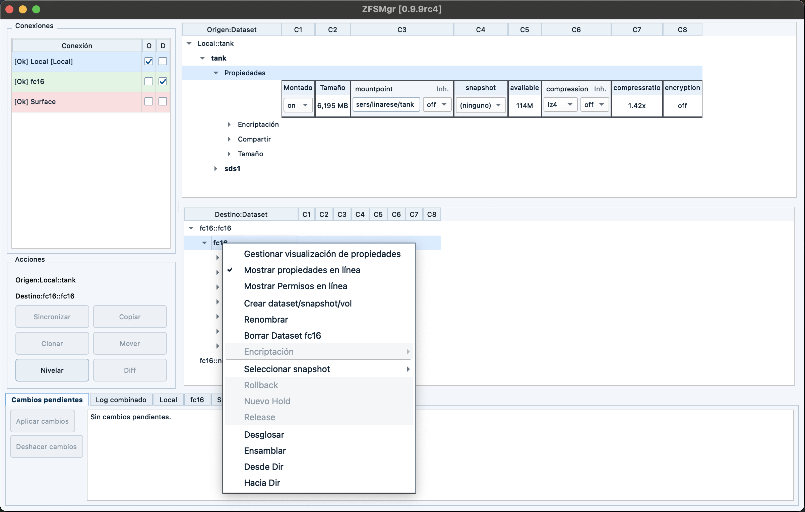
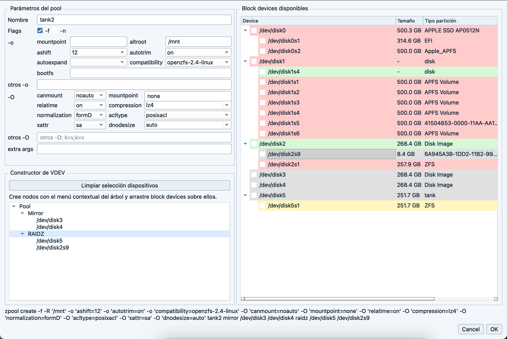
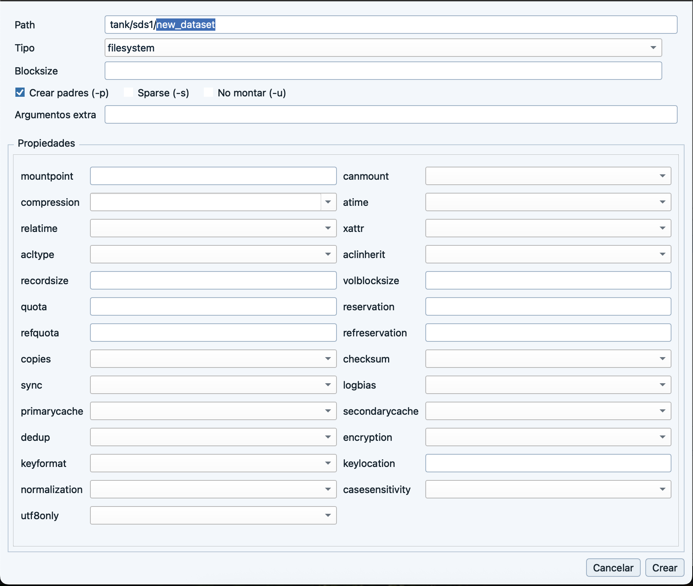

# ZFSMgr: OpenZFS GUI Manager for Local and Remote Systems

**ZFSMgr** is a **full OpenZFS GUI manager** built with **C++17 + Qt6** for **Linux, macOS, and Windows**.

If you are looking for a **ZFS GUI manager**, **OpenZFS GUI**, **remote ZFS manager**, or a **desktop ZFS administration tool**, ZFSMgr is designed to cover the whole workflow from one interface:

- pools,
- datasets,
- snapshots,
- properties,
- delegated permissions,
- encryption,
- replication flows,
- and remote administration over SSH.

ZFSMgr is not a simple pool browser. It is intended to be a **complete graphical manager for ZFS and OpenZFS environments**, including **remote pools and datasets on other machines**.

## Beta notice and legal disclaimer

This software is currently a **BETA** release and is provided **"AS IS"**.

- It may contain defects, regressions, data-loss scenarios, or incomplete behaviors.
- Use it at your own risk, especially on production systems or critical data.
- The author (Eladio Linares) provides **no warranty** and assumes **no liability** for direct or indirect damage, data loss, service interruption, or any other consequence derived from use.

Legal references:

- **GNU GPL v3**, Section 15: **Disclaimer of Warranty**.
- **GNU GPL v3**, Section 16: **Limitation of Liability**.

## Screenshots

### Main window



### Pool creation



### Dataset creation



## Releases

- **Current beta line: 0.10.0rc1**: https://github.com/Nazari/ZFSMgr/releases

## Why ZFSMgr

ZFSMgr is designed for users who want a real **GUI for ZFS administration** without giving up low-level OpenZFS functionality.

It gives you:

- a **dual source/destination view** for comparing and operating on two ZFS trees at once,
- **remote pool and dataset management** from the same desktop app,
- a **connectivity matrix** between connections with `SSH` and `rsync` checks,
- **inline editing** of dataset and pool properties directly in the treeview,
- **permission delegation management** with `zfs allow` / `zfs unallow`,
- **automatic snapshot scheduling (GSA)** using the native scheduler of each OS,
- **snapshot-oriented workflows** such as copy, clone, diff, rollback and level/sync,
- a **graphical pool builder** with OpenZFS-aware VDEV validation,
- **encrypted dataset creation and mount flows** with passphrase prompts when `keylocation=prompt`,
- **persistent operational logs** with secret masking,
- and **native system logging** integration on macOS, Linux and Windows.

## Main capabilities

### Pool management

- Imported and importable pool discovery.
- Pool import/export.
- Pool import with rename validation from the context menu.
- Pool creation with device selection and options.
- Device tree for available block devices, including whole disks and partitions.
- OpenZFS-aware pool layout builder:
  - direct devices at pool root for implicit stripe,
  - `mirror`,
  - `raidz`, `raidz2`, `raidz3`,
  - top-level classes such as `log`, `cache`, `special`, `dedup`, `spare`.
- Live `zpool create` preview with invalid layouts highlighted in red.
- macOS-specific filtering for internal APFS/synthesized system disks.
- Mount-state controls in the pool-creation dialog to unmount devices before use.
- Pool destroy with confirmation.
- Pool history view.
- Pool maintenance actions from the GUI:
  - `zpool sync`
  - `zpool scrub`
  - `zpool reguid`
  - `zpool trim`
  - `zpool initialize`
- Pool information and feature visibility directly in the treeview.

### Dataset, zvol and snapshot management

- Create dataset, snapshot and zvol.
- Automatic snapshot scheduling node for filesystem datasets.
- Create encrypted datasets with passphrase confirmation when using:
  - `encryption=on` or `aes-*`,
  - `keyformat=passphrase`,
  - `keylocation=prompt`.
- Rename and delete datasets.
- Context-aware delete actions for:
  - dataset,
  - snapshot,
  - zvol.
- Mount/unmount operations.
- Mount encrypted datasets by prompting for the passphrase and loading the key before mount when required.
- Snapshot rollback.
- Snapshot selection in source/destination trees.
- Optional filtering of automatic snapshots (`GSA-*`) from dataset context menus.
- Snapshot holds:
  - create hold,
  - inspect hold timestamp,
  - release hold.

### Automatic snapshot scheduling (GSA)

- Per-connection GSA management from the connection context menu.
- Dynamic GSA actions depending on state:
  - install,
  - update,
  - enable,
  - uninstall,
  - up-to-date/running state.
- Native scheduler integration:
  - `launchd` on macOS,
  - `systemd timer` on Linux,
  - `Task Scheduler` on Windows.
- Inline dataset scheduling properties stored as ZFS user properties (`org.fc16.gsa:*`):
  - enabled,
  - recursive,
  - hourly/daily/weekly/monthly/yearly retention,
  - leveling,
  - destination dataset.
- Destination values use the `Connection::Pool/Dataset` format.
- GSA does not dynamically read the connection list from the machine running ZFSMgr.
  Instead, when ZFSMgr installs or updates GSA on a connection, it deploys a payload that includes a static destination map for that connection.
- Operational consequence:
  when a connection changes (`host`, `port`, `username`, `password`, SSH key or `sudo` settings), previously installed GSA payloads may become outdated until they are refreshed.
- ZFSMgr can refresh installed GSA payloads automatically after connection changes, but the current design still depends on deployed static payloads.
- Validation to avoid conflicting recursive schedules between parent and child datasets.
- Sequential leveling support toward configured destination datasets.
- Scheduler log rotation in `GSA.log` inside the ZFSMgr configuration directory.
- High-level GSA events are also forwarded to the native OS log.
- Current platform note:
  Unix/macOS payloads resolve remote destinations through the embedded connection map, while Windows does not yet have full parity for arbitrary remote leveling routes.

### Inline property management

- Dataset, pool and snapshot properties shown **inline in the treeview**.
- Visual property groups per scope:
  - pool,
  - dataset,
  - snapshot.
- Reorder visible properties by drag and drop.
- Persist visible properties and order in configuration.
- Inline editing of property values.
- Inline inheritance controls for inheritable properties.
- Property column count configurable from the tree header context menu.
- Independent column widths for top and bottom trees, with persistence in `config.ini`.

### ZFS permissions management

ZFSMgr includes **graphical management of delegated ZFS permissions** per dataset.

Current permission features include:

- `Permisos` node in dataset trees.
- Delegation management based on:
  - `zfs allow`
  - `zfs unallow`
- Support for:
  - users,
  - groups,
  - `everyone`,
  - local / descendant / local+descendant scopes,
  - creation-time permissions,
  - permission sets (`@setname`).
- Inline permission editing in treeview grids.
- Draft-based permission editing with batch application through **`Aplicar cambios`**.
- Remote user/group enumeration on Linux, FreeBSD and macOS.
- Windows excluded from permission UI in this phase.

### Encryption workflows

- Encryption submenu for encryption-root datasets.
- `Load key`.
- `Unload key`.
- `Change key`.
- Prompted password entry when `keylocation=prompt`.
- `Create dataset` and `Mount` integrate passphrase prompts instead of expecting interactive shell input.

### Source/destination workflows

ZFSMgr uses a **source / destination model** directly in the main window.

That enables:

- snapshot copy (`zfs send` / `zfs recv`),
- snapshot clone,
- `zfs diff` integration,
- level / sync operations,
- advanced breakdown / assemble operations,
- `From Dir` and `To Dir` flows.

The `Diff` action includes a dedicated results window with grouped tree output for:

- added files,
- deleted files,
- modified files,
- renamed files.

### Connectivity matrix

- Floating `Conectividad` button in the connections table.
- Matrix view with connections as rows and columns.
- Per-cell checks for:
  - `SSH`
  - `rsync`
- If a direct route is not available, transfers may need to pass through the local machine running ZFSMgr, which is more expensive than a direct remote-to-remote path.
- GSA warns before installation or update if a required remote leveling route does not have `SSH` connectivity.

### Logging and safety

- Combined in-app log.
- Persistent rotating logs.
- Native system log integration:
  - macOS Unified Logging,
  - Linux `syslog` / `journald`,
  - Windows Event Log (best effort).
- Secret masking (`[secret]`).
- Command previews and execution traces.
- Busy-state locking for unsafe concurrent actions.
- Async refresh safeguards to avoid stale refresh results being applied to the wrong connection.
- Current GSA security model:
  - GSA is functional, but its deployed payload is not yet fully hardened.
  - Unix/macOS payloads may embed destination connection details for remote leveling.
  - If password-based SSH or password-based `sudo` is used, those secrets may become part of the deployed payload.
  - The current remote-leveling path prioritizes operability and compatibility over strict SSH trust validation.
- Recommended hardening direction:
  - separate the stable GSA script from a protected deployed connection-config file,
  - deploy only the minimum destination map required by each source connection,
  - tighten file permissions,
  - and replace permissive SSH trust handling with pinned host-key validation.
- See [docs/propuesta_endurecimiento_gsa.md](docs/propuesta_endurecimiento_gsa.md) for the hardening proposal.

## Remote ZFS management

ZFSMgr is designed to manage **local and remote OpenZFS systems**.

You can work against:

- local Linux systems,
- remote Linux systems,
- remote macOS systems,
- remote Unix-like systems,
- Windows hosts with the required OpenZFS tooling and compatible shell/runtime.

This makes ZFSMgr suitable as a **remote ZFS GUI manager** for homelabs, NAS hosts, backup servers and multi-machine OpenZFS administration.

## Windows compatibility checks

For Windows targets, ZFSMgr validates runtime prerequisites so operations can run safely:

- OpenZFS tools availability (`zfs`, `zpool`), including common install paths.
- Shell/runtime availability and compatibility (PowerShell and optional MSYS64/MINGW tooling when needed).
- Command path resolution and fallback behavior for mixed Unix/Windows command flows.
- Mount semantics handling, including effective `driveletter` resolution.

If required components are missing, the UI reports the situation clearly in connection status and logs.

## UI model

- Left panel:
  - connections,
  - source/destination actions,
  - global quick operations.
- Right panel:
  - top tree = `Origen`,
  - bottom tree = `Destino`.
- Bottom area:
  - combined log.

Important characteristics:

- The effective detail selection is driven by **Origen / Destino checks**, not by a simple row click.
- Top and bottom trees preserve their own navigation state.
- Creation dialogs stay open on execution failure so entered values can be corrected and retried.
- Tree headers include context actions for:
  - resize this column,
  - resize all columns,
  - choose property column count.
- `Aplicar cambios` batches real pending commands and shows them in a tooltip before execution.

## Configuration and data

- User config location: `~/.config/ZFSMgr/` on Linux (Qt-equivalent path on macOS/Windows).
- Main config file: `config.ini`.
- One file per connection: `conn_*.ini`.
- Master password used to protect credentials in configuration.

Persistent configuration includes, among other things:

- connections,
- selected source/destination trees,
- visible property groups,
- inline property order,
- tree column widths,
- UI state relevant to the dual-tree workflow.

## Build requirements

- CMake >= 3.21
- C++17-capable compiler
- Qt6 (`Core`, `Gui`, `Widgets`)
- OpenSSL (especially relevant on Windows/Qt environments)

## Quick build

### Linux

```bash
./scripts/build-linux.sh
```

Expected binary: `build-linux/zfsmgr_qt`

### Linux AppImage (portable)

```bash
./scripts/build-linux.sh --appimage
```

What it does:

- builds a Release binary,
- creates an AppDir,
- bundles Qt dependencies with `linuxdeploy` + `linuxdeploy-plugin-qt`,
- generates `ZFSMgr-0.10.0rc1-x86_64.AppImage`.

Notes:

- Current script target: `x86_64`.
- Requires `curl` and a working Qt toolchain in PATH (`qmake6`/`qmake`).
- The script auto-downloads `linuxdeploy` tools into `.tools/appimage/`.

### macOS

```bash
./scripts/build-macos.sh
```

The script builds the binary and can also generate an unsigned `.app` bundle.

### Windows (PowerShell)

```powershell
.\scripts\build-windows.ps1
```

The script auto-detects toolchain/Qt and builds under `build-windows`.

Installer generation is now explicit:

```powershell
.\scripts\build-windows.ps1 --inno
```

Without `--inno`, the script only builds the application and skips Inno Setup packaging. This is also the behavior expected in GitHub Actions.

On Windows, `zfsmgr_qt.exe` is built with an embedded UAC manifest and must be started with administrator privileges.

## Run

After building, run the generated binary for your platform and unlock it with the master password.

## Keywords

OpenZFS GUI, ZFS GUI manager, remote ZFS manager, ZFS desktop manager, graphical ZFS administration, ZFS snapshot manager, ZFS permissions GUI, zpool GUI, dataset manager, OpenZFS remote administration.
